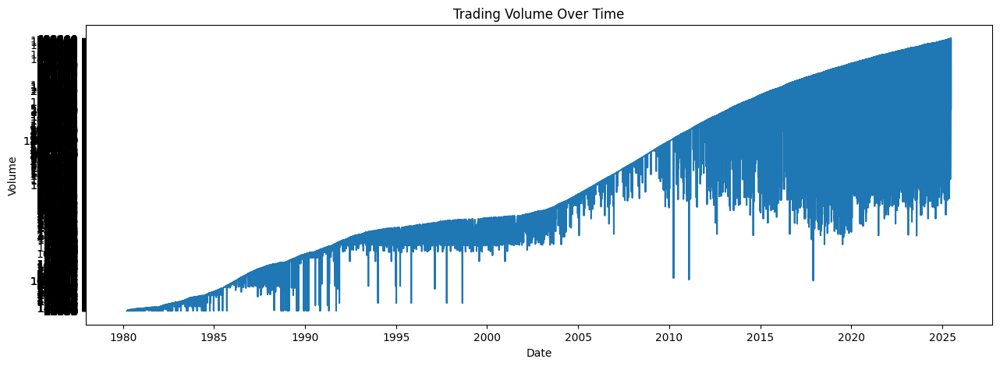
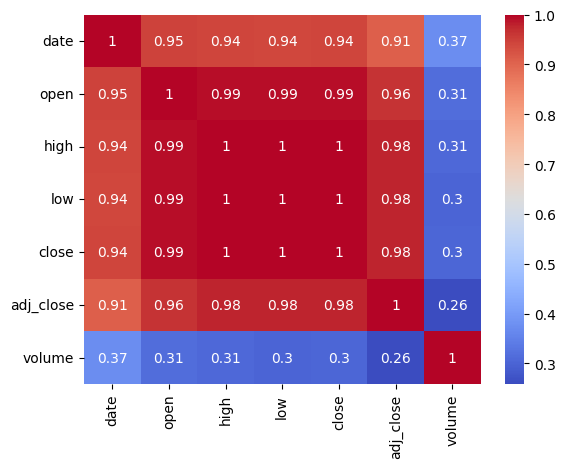
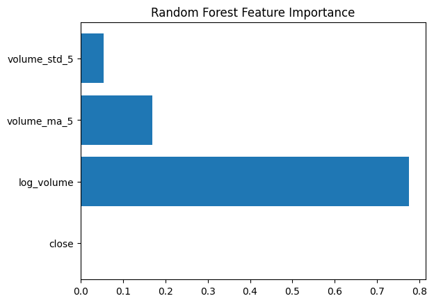
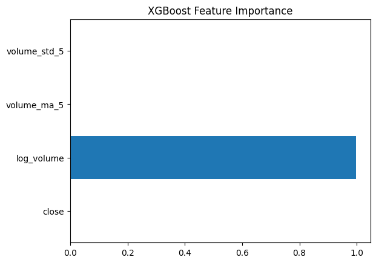

Data Loading


```python
import pandas as pd
import warnings 
warnings.filterwarnings("ignore")

# Load the data
df = pd.read_csv(r'C:\Users\User\Downloads\Anaconda\TOYOTA Stock Data\TOYOTA.csv')
print(df.head())

```

             date                open                high                 low  \
    0         NaN                  TM                  TM                  TM   
    1  1980-03-17                 0.0   3.344743013381958   3.291227102279663   
    2  1980-03-18                 0.0  3.3581221103668213  3.3046059608459473   
    3  1980-03-19  3.3046059608459473  3.3046059608459473  3.3046059608459473   
    4  1980-03-20                 0.0  3.3581221103668213  3.3046059608459473   
    
                    close           adj_close volume  
    0                  TM                  TM     TM  
    1   3.291227102279663  1.8489787578582764  41109  
    2  3.3046059608459473  1.8564950227737427   9343  
    3  3.3046059608459473  1.8564950227737427      0  
    4  3.3046059608459473  1.8564950227737427  10277  
    

Data Cleaning


```python
# Check for missing values
print(df.isnull().sum())

# Replace zero values with NaN in numeric columns (excluding 'date')
cols_to_check = ['open', 'high', 'close', 'adj_close', 'volume']
df[cols_to_check] = df[cols_to_check].replace(0, pd.NA)

# Drop or impute missing values
df.dropna(inplace=True)  

# Convert date to datetime
df['date'] = pd.to_datetime(df['date'])

# Sort by date
df.sort_values('date', inplace=True)

```

    date         1
    open         0
    high         0
    low          0
    close        0
    adj_close    0
    volume       0
    dtype: int64
    

Exploratory Data Analysis (EDA)


```python
import matplotlib.pyplot as plt
import seaborn as sns

# Volume over time
plt.figure(figsize=(15,5))
plt.plot(df['date'], df['volume'])
plt.title('Trading Volume Over Time')
plt.xlabel('Date'); plt.ylabel('Volume')
plt.show()

# Correlation heatmap
sns.heatmap(df.corr(), annot=True, cmap='coolwarm')

```


    

    


    <Axes: >


    

    


 Insights from the Correlation Heatmap


open, high, low, close, and adj_close are highly correlated (almost 1.00) → multicollinearity.

volume has low correlation with price-based features (~0.3), which is good for predictive modeling of liquidity risk, since it's more independent.

date has some correlation with price (~0.9) but that’s expected due to long-term upward trends.

✅ Actionable Insight:

We should drop redundant features to avoid multicollinearity issues (e.g., keep only close or adj_close).

Insights from Volume Time Series Plot


There’s a gradual increase in volume over the years with extreme volatility spikes.

Some years (especially recent ones) show very low volumes, likely indicating potential liquidity risks.

✅ Actionable Insight:

We should consider log-transforming volume to reduce skewness.

Use rolling averages or volatility bands to detect anomalous behavior.

Feature Engineering 


```python
# Convert volume to numeric
df_model['volume'] = pd.to_numeric(df_model['volume'], errors='coerce')

```


```python
import numpy as np

# Log transform to normalize volume
df_model['log_volume'] = np.log1p(df_model['volume'])

# Create rolling average and volatility
df_model['volume_ma_5'] = df_model['volume'].rolling(window=5).mean()
df_model['volume_std_5'] = df_model['volume'].rolling(window=5).std()

# Create target variable for illiquidity
threshold = df_model['volume'].quantile(0.25)
df_model['illiquid_day'] = (df_model['volume'] < threshold).astype(int)

# Drop rows with NaNs (caused by rolling or coercion)
df_model.dropna(inplace=True)

```

Defining Features and Target and scalling (Standardization)


```python
from sklearn.model_selection import train_test_split

# Define features and target
features = ['close', 'log_volume', 'volume_ma_5', 'volume_std_5']
X = df_model[features]
y = df_model['illiquid_day']

# Use stratified sampling
X_train, X_test, y_train, y_test = train_test_split(
    X, y, test_size=0.2, stratify=y, random_state=42
)

# Check the class balance
print("Train class balance:\n", y_train.value_counts())
print("Test class balance:\n", y_test.value_counts())

```

    Train class balance:
     illiquid_day
    0    6849
    1    2278
    Name: count, dtype: int64
    Test class balance:
     illiquid_day
    0    1713
    1     569
    Name: count, dtype: int64
    


```python
from sklearn.preprocessing import StandardScaler

scaler = StandardScaler()
X_train_scaled = scaler.fit_transform(X_train)
X_test_scaled = scaler.transform(X_test)

```

Training Three Models


```python
from sklearn.linear_model import LogisticRegression
from sklearn.ensemble import RandomForestClassifier
from xgboost import XGBClassifier

# Logistic Regression
log_reg = LogisticRegression()
log_reg.fit(X_train_scaled, y_train)

# Random Forest
rf = RandomForestClassifier(n_estimators=100, random_state=42)
rf.fit(X_train, y_train)

# XGBoost
xgb = XGBClassifier(use_label_encoder=False, eval_metric='logloss', random_state=42)
xgb.fit(X_train, y_train)

```


<style>#sk-container-id-3 {
  /* Definition of color scheme common for light and dark mode */
  --sklearn-color-text: black;
  --sklearn-color-line: gray;
  /* Definition of color scheme for unfitted estimators */
  --sklearn-color-unfitted-level-0: #fff5e6;
  --sklearn-color-unfitted-level-1: #f6e4d2;
  --sklearn-color-unfitted-level-2: #ffe0b3;
  --sklearn-color-unfitted-level-3: chocolate;
  /* Definition of color scheme for fitted estimators */
  --sklearn-color-fitted-level-0: #f0f8ff;
  --sklearn-color-fitted-level-1: #d4ebff;
  --sklearn-color-fitted-level-2: #b3dbfd;
  --sklearn-color-fitted-level-3: cornflowerblue;

  /* Specific color for light theme */
  --sklearn-color-text-on-default-background: var(--sg-text-color, var(--theme-code-foreground, var(--jp-content-font-color1, black)));
  --sklearn-color-background: var(--sg-background-color, var(--theme-background, var(--jp-layout-color0, white)));
  --sklearn-color-border-box: var(--sg-text-color, var(--theme-code-foreground, var(--jp-content-font-color1, black)));
  --sklearn-color-icon: #696969;

  @media (prefers-color-scheme: dark) {
    /* Redefinition of color scheme for dark theme */
    --sklearn-color-text-on-default-background: var(--sg-text-color, var(--theme-code-foreground, var(--jp-content-font-color1, white)));
    --sklearn-color-background: var(--sg-background-color, var(--theme-background, var(--jp-layout-color0, #111)));
    --sklearn-color-border-box: var(--sg-text-color, var(--theme-code-foreground, var(--jp-content-font-color1, white)));
    --sklearn-color-icon: #878787;
  }
}

#sk-container-id-3 {
  color: var(--sklearn-color-text);
}

#sk-container-id-3 pre {
  padding: 0;
}

#sk-container-id-3 input.sk-hidden--visually {
  border: 0;
  clip: rect(1px 1px 1px 1px);
  clip: rect(1px, 1px, 1px, 1px);
  height: 1px;
  margin: -1px;
  overflow: hidden;
  padding: 0;
  position: absolute;
  width: 1px;
}

#sk-container-id-3 div.sk-dashed-wrapped {
  border: 1px dashed var(--sklearn-color-line);
  margin: 0 0.4em 0.5em 0.4em;
  box-sizing: border-box;
  padding-bottom: 0.4em;
  background-color: var(--sklearn-color-background);
}

#sk-container-id-3 div.sk-container {
  /* jupyter's `normalize.less` sets `[hidden] { display: none; }`
     but bootstrap.min.css set `[hidden] { display: none !important; }`
     so we also need the `!important` here to be able to override the
     default hidden behavior on the sphinx rendered scikit-learn.org.
     See: https://github.com/scikit-learn/scikit-learn/issues/21755 */
  display: inline-block !important;
  position: relative;
}

#sk-container-id-3 div.sk-text-repr-fallback {
  display: none;
}

div.sk-parallel-item,
div.sk-serial,
div.sk-item {
  /* draw centered vertical line to link estimators */
  background-image: linear-gradient(var(--sklearn-color-text-on-default-background), var(--sklearn-color-text-on-default-background));
  background-size: 2px 100%;
  background-repeat: no-repeat;
  background-position: center center;
}

/* Parallel-specific style estimator block */

#sk-container-id-3 div.sk-parallel-item::after {
  content: "";
  width: 100%;
  border-bottom: 2px solid var(--sklearn-color-text-on-default-background);
  flex-grow: 1;
}

#sk-container-id-3 div.sk-parallel {
  display: flex;
  align-items: stretch;
  justify-content: center;
  background-color: var(--sklearn-color-background);
  position: relative;
}

#sk-container-id-3 div.sk-parallel-item {
  display: flex;
  flex-direction: column;
}

#sk-container-id-3 div.sk-parallel-item:first-child::after {
  align-self: flex-end;
  width: 50%;
}

#sk-container-id-3 div.sk-parallel-item:last-child::after {
  align-self: flex-start;
  width: 50%;
}

#sk-container-id-3 div.sk-parallel-item:only-child::after {
  width: 0;
}

/* Serial-specific style estimator block */

#sk-container-id-3 div.sk-serial {
  display: flex;
  flex-direction: column;
  align-items: center;
  background-color: var(--sklearn-color-background);
  padding-right: 1em;
  padding-left: 1em;
}


/* Toggleable style: style used for estimator/Pipeline/ColumnTransformer box that is
clickable and can be expanded/collapsed.
- Pipeline and ColumnTransformer use this feature and define the default style
- Estimators will overwrite some part of the style using the `sk-estimator` class
*/

/* Pipeline and ColumnTransformer style (default) */

#sk-container-id-3 div.sk-toggleable {
  /* Default theme specific background. It is overwritten whether we have a
  specific estimator or a Pipeline/ColumnTransformer */
  background-color: var(--sklearn-color-background);
}

/* Toggleable label */
#sk-container-id-3 label.sk-toggleable__label {
  cursor: pointer;
  display: block;
  width: 100%;
  margin-bottom: 0;
  padding: 0.5em;
  box-sizing: border-box;
  text-align: center;
}

#sk-container-id-3 label.sk-toggleable__label-arrow:before {
  /* Arrow on the left of the label */
  content: "▸";
  float: left;
  margin-right: 0.25em;
  color: var(--sklearn-color-icon);
}

#sk-container-id-3 label.sk-toggleable__label-arrow:hover:before {
  color: var(--sklearn-color-text);
}

/* Toggleable content - dropdown */

#sk-container-id-3 div.sk-toggleable__content {
  max-height: 0;
  max-width: 0;
  overflow: hidden;
  text-align: left;
  /* unfitted */
  background-color: var(--sklearn-color-unfitted-level-0);
}

#sk-container-id-3 div.sk-toggleable__content.fitted {
  /* fitted */
  background-color: var(--sklearn-color-fitted-level-0);
}

#sk-container-id-3 div.sk-toggleable__content pre {
  margin: 0.2em;
  border-radius: 0.25em;
  color: var(--sklearn-color-text);
  /* unfitted */
  background-color: var(--sklearn-color-unfitted-level-0);
}

#sk-container-id-3 div.sk-toggleable__content.fitted pre {
  /* unfitted */
  background-color: var(--sklearn-color-fitted-level-0);
}

#sk-container-id-3 input.sk-toggleable__control:checked~div.sk-toggleable__content {
  /* Expand drop-down */
  max-height: 200px;
  max-width: 100%;
  overflow: auto;
}

#sk-container-id-3 input.sk-toggleable__control:checked~label.sk-toggleable__label-arrow:before {
  content: "▾";
}

/* Pipeline/ColumnTransformer-specific style */

#sk-container-id-3 div.sk-label input.sk-toggleable__control:checked~label.sk-toggleable__label {
  color: var(--sklearn-color-text);
  background-color: var(--sklearn-color-unfitted-level-2);
}

#sk-container-id-3 div.sk-label.fitted input.sk-toggleable__control:checked~label.sk-toggleable__label {
  background-color: var(--sklearn-color-fitted-level-2);
}

/* Estimator-specific style */

/* Colorize estimator box */
#sk-container-id-3 div.sk-estimator input.sk-toggleable__control:checked~label.sk-toggleable__label {
  /* unfitted */
  background-color: var(--sklearn-color-unfitted-level-2);
}

#sk-container-id-3 div.sk-estimator.fitted input.sk-toggleable__control:checked~label.sk-toggleable__label {
  /* fitted */
  background-color: var(--sklearn-color-fitted-level-2);
}

#sk-container-id-3 div.sk-label label.sk-toggleable__label,
#sk-container-id-3 div.sk-label label {
  /* The background is the default theme color */
  color: var(--sklearn-color-text-on-default-background);
}

/* On hover, darken the color of the background */
#sk-container-id-3 div.sk-label:hover label.sk-toggleable__label {
  color: var(--sklearn-color-text);
  background-color: var(--sklearn-color-unfitted-level-2);
}

/* Label box, darken color on hover, fitted */
#sk-container-id-3 div.sk-label.fitted:hover label.sk-toggleable__label.fitted {
  color: var(--sklearn-color-text);
  background-color: var(--sklearn-color-fitted-level-2);
}

/* Estimator label */

#sk-container-id-3 div.sk-label label {
  font-family: monospace;
  font-weight: bold;
  display: inline-block;
  line-height: 1.2em;
}

#sk-container-id-3 div.sk-label-container {
  text-align: center;
}

/* Estimator-specific */
#sk-container-id-3 div.sk-estimator {
  font-family: monospace;
  border: 1px dotted var(--sklearn-color-border-box);
  border-radius: 0.25em;
  box-sizing: border-box;
  margin-bottom: 0.5em;
  /* unfitted */
  background-color: var(--sklearn-color-unfitted-level-0);
}

#sk-container-id-3 div.sk-estimator.fitted {
  /* fitted */
  background-color: var(--sklearn-color-fitted-level-0);
}

/* on hover */
#sk-container-id-3 div.sk-estimator:hover {
  /* unfitted */
  background-color: var(--sklearn-color-unfitted-level-2);
}

#sk-container-id-3 div.sk-estimator.fitted:hover {
  /* fitted */
  background-color: var(--sklearn-color-fitted-level-2);
}

/* Specification for estimator info (e.g. "i" and "?") */

/* Common style for "i" and "?" */

.sk-estimator-doc-link,
a:link.sk-estimator-doc-link,
a:visited.sk-estimator-doc-link {
  float: right;
  font-size: smaller;
  line-height: 1em;
  font-family: monospace;
  background-color: var(--sklearn-color-background);
  border-radius: 1em;
  height: 1em;
  width: 1em;
  text-decoration: none !important;
  margin-left: 1ex;
  /* unfitted */
  border: var(--sklearn-color-unfitted-level-1) 1pt solid;
  color: var(--sklearn-color-unfitted-level-1);
}

.sk-estimator-doc-link.fitted,
a:link.sk-estimator-doc-link.fitted,
a:visited.sk-estimator-doc-link.fitted {
  /* fitted */
  border: var(--sklearn-color-fitted-level-1) 1pt solid;
  color: var(--sklearn-color-fitted-level-1);
}

/* On hover */
div.sk-estimator:hover .sk-estimator-doc-link:hover,
.sk-estimator-doc-link:hover,
div.sk-label-container:hover .sk-estimator-doc-link:hover,
.sk-estimator-doc-link:hover {
  /* unfitted */
  background-color: var(--sklearn-color-unfitted-level-3);
  color: var(--sklearn-color-background);
  text-decoration: none;
}

div.sk-estimator.fitted:hover .sk-estimator-doc-link.fitted:hover,
.sk-estimator-doc-link.fitted:hover,
div.sk-label-container:hover .sk-estimator-doc-link.fitted:hover,
.sk-estimator-doc-link.fitted:hover {
  /* fitted */
  background-color: var(--sklearn-color-fitted-level-3);
  color: var(--sklearn-color-background);
  text-decoration: none;
}

/* Span, style for the box shown on hovering the info icon */
.sk-estimator-doc-link span {
  display: none;
  z-index: 9999;
  position: relative;
  font-weight: normal;
  right: .2ex;
  padding: .5ex;
  margin: .5ex;
  width: min-content;
  min-width: 20ex;
  max-width: 50ex;
  color: var(--sklearn-color-text);
  box-shadow: 2pt 2pt 4pt #999;
  /* unfitted */
  background: var(--sklearn-color-unfitted-level-0);
  border: .5pt solid var(--sklearn-color-unfitted-level-3);
}

.sk-estimator-doc-link.fitted span {
  /* fitted */
  background: var(--sklearn-color-fitted-level-0);
  border: var(--sklearn-color-fitted-level-3);
}

.sk-estimator-doc-link:hover span {
  display: block;
}

/* "?"-specific style due to the `<a>` HTML tag */

#sk-container-id-3 a.estimator_doc_link {
  float: right;
  font-size: 1rem;
  line-height: 1em;
  font-family: monospace;
  background-color: var(--sklearn-color-background);
  border-radius: 1rem;
  height: 1rem;
  width: 1rem;
  text-decoration: none;
  /* unfitted */
  color: var(--sklearn-color-unfitted-level-1);
  border: var(--sklearn-color-unfitted-level-1) 1pt solid;
}

#sk-container-id-3 a.estimator_doc_link.fitted {
  /* fitted */
  border: var(--sklearn-color-fitted-level-1) 1pt solid;
  color: var(--sklearn-color-fitted-level-1);
}

/* On hover */
#sk-container-id-3 a.estimator_doc_link:hover {
  /* unfitted */
  background-color: var(--sklearn-color-unfitted-level-3);
  color: var(--sklearn-color-background);
  text-decoration: none;
}

#sk-container-id-3 a.estimator_doc_link.fitted:hover {
  /* fitted */
  background-color: var(--sklearn-color-fitted-level-3);
}
</style><div id="sk-container-id-3" class="sk-top-container"><div class="sk-text-repr-fallback"><pre>XGBClassifier(base_score=None, booster=None, callbacks=None,
              colsample_bylevel=None, colsample_bynode=None,
              colsample_bytree=None, device=None, early_stopping_rounds=None,
              enable_categorical=False, eval_metric=&#x27;logloss&#x27;,
              feature_types=None, feature_weights=None, gamma=None,
              grow_policy=None, importance_type=None,
              interaction_constraints=None, learning_rate=None, max_bin=None,
              max_cat_threshold=None, max_cat_to_onehot=None,
              max_delta_step=None, max_depth=None, max_leaves=None,
              min_child_weight=None, missing=nan, monotone_constraints=None,
              multi_strategy=None, n_estimators=None, n_jobs=None,
              num_parallel_tree=None, ...)</pre><b>In a Jupyter environment, please rerun this cell to show the HTML representation or trust the notebook. <br />On GitHub, the HTML representation is unable to render, please try loading this page with nbviewer.org.</b></div><div class="sk-container" hidden><div class="sk-item"><div class="sk-estimator fitted sk-toggleable"><input class="sk-toggleable__control sk-hidden--visually" id="sk-estimator-id-3" type="checkbox" checked><label for="sk-estimator-id-3" class="sk-toggleable__label fitted sk-toggleable__label-arrow fitted">&nbsp;&nbsp;XGBClassifier<a class="sk-estimator-doc-link fitted" rel="noreferrer" target="_blank" href="https://xgboost.readthedocs.io/en/release_3.0.0/python/python_api.html#xgboost.XGBClassifier">?<span>Documentation for XGBClassifier</span></a><span class="sk-estimator-doc-link fitted">i<span>Fitted</span></span></label><div class="sk-toggleable__content fitted"><pre>XGBClassifier(base_score=None, booster=None, callbacks=None,
              colsample_bylevel=None, colsample_bynode=None,
              colsample_bytree=None, device=None, early_stopping_rounds=None,
              enable_categorical=False, eval_metric=&#x27;logloss&#x27;,
              feature_types=None, feature_weights=None, gamma=None,
              grow_policy=None, importance_type=None,
              interaction_constraints=None, learning_rate=None, max_bin=None,
              max_cat_threshold=None, max_cat_to_onehot=None,
              max_delta_step=None, max_depth=None, max_leaves=None,
              min_child_weight=None, missing=nan, monotone_constraints=None,
              multi_strategy=None, n_estimators=None, n_jobs=None,
              num_parallel_tree=None, ...)</pre></div> </div></div></div></div>


evaluating Models


```python
from sklearn.metrics import classification_report, confusion_matrix, accuracy_score, roc_auc_score

models = {
    'Logistic Regression': (log_reg, X_test_scaled),
    'Random Forest': (rf, X_test),
    'XGBoost': (xgb, X_test)
}

for name, (model, X_eval) in models.items():
    y_pred = model.predict(X_eval)
    print(f"\n📌 {name} Evaluation")
    print("Confusion Matrix:\n", confusion_matrix(y_test, y_pred))
    print("Classification Report:\n", classification_report(y_test, y_pred))
    print("Accuracy:", accuracy_score(y_test, y_pred))

    try:
        print("ROC AUC Score:", roc_auc_score(y_test, y_pred))
    except ValueError:
        print("ROC AUC Score: Undefined (only one class in y_test)")

```

    
    📌 Logistic Regression Evaluation
    Confusion Matrix:
     [[1712    1]
     [   1  568]]
    Classification Report:
                   precision    recall  f1-score   support
    
               0       1.00      1.00      1.00      1713
               1       1.00      1.00      1.00       569
    
        accuracy                           1.00      2282
       macro avg       1.00      1.00      1.00      2282
    weighted avg       1.00      1.00      1.00      2282
    
    Accuracy: 0.9991235758106923
    ROC AUC Score: 0.9988293797970036
    
    📌 Random Forest Evaluation
    Confusion Matrix:
     [[1713    0]
     [   0  569]]
    Classification Report:
                   precision    recall  f1-score   support
    
               0       1.00      1.00      1.00      1713
               1       1.00      1.00      1.00       569
    
        accuracy                           1.00      2282
       macro avg       1.00      1.00      1.00      2282
    weighted avg       1.00      1.00      1.00      2282
    
    Accuracy: 1.0
    ROC AUC Score: 1.0
    
    📌 XGBoost Evaluation
    Confusion Matrix:
     [[1712    1]
     [   2  567]]
    Classification Report:
                   precision    recall  f1-score   support
    
               0       1.00      1.00      1.00      1713
               1       1.00      1.00      1.00       569
    
        accuracy                           1.00      2282
       macro avg       1.00      1.00      1.00      2282
    weighted avg       1.00      1.00      1.00      2282
    
    Accuracy: 0.9986853637160386
    ROC AUC Score: 0.9979506451748595
    


```python
from sklearn.model_selection import cross_val_score

# Cross-validation accuracy (Logistic Regression example)
scores = cross_val_score(log_reg, X_train_scaled, y_train, cv=5)
print("Cross-val accuracy (mean):", scores.mean())

```

    Cross-val accuracy (mean): 0.9974800522138366
    

Interpretation from the previous 
All models accurately distinguish between liquid and illiquid days based on volume behavior.

Random Forest slightly outperforms the others with perfect classification.

XGBoost and Logistic Regression are also very strong, only missing a few cases.

Also the logistic regression model is generalizing well — not just memorizing the training data.

The low variance across folds suggests that the data distribution is stable, and the model is not overfitting.


```python
import matplotlib.pyplot as plt

# For Random Forest and XGBoost
def plot_importance(model, name):
    importance = model.feature_importances_
    plt.barh(features, importance)
    plt.title(f"{name} Feature Importance")
    plt.show()

plot_importance(rf, "Random Forest")
plot_importance(xgb, "XGBoost")

```


    

    


    

    


```python

```
